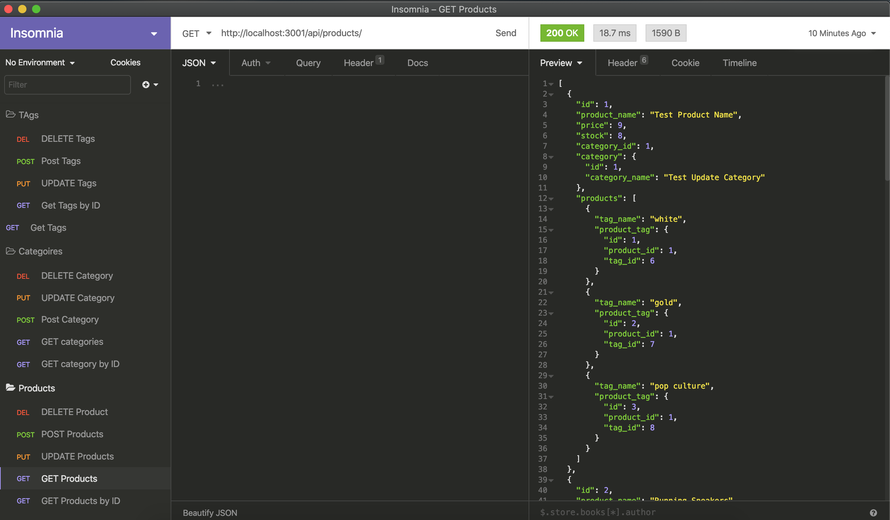

# eCommerce-backend

This backend replicates a backend that would be used for various e-Commerce businesses in order to manage inventory and purchasing. All products are identifed by specific categories and tags and contain information about how many units are in stock and the unit price of each product.  

__Built With__
* node.js
* express
* mysql2
* sequelize
* dotenv

